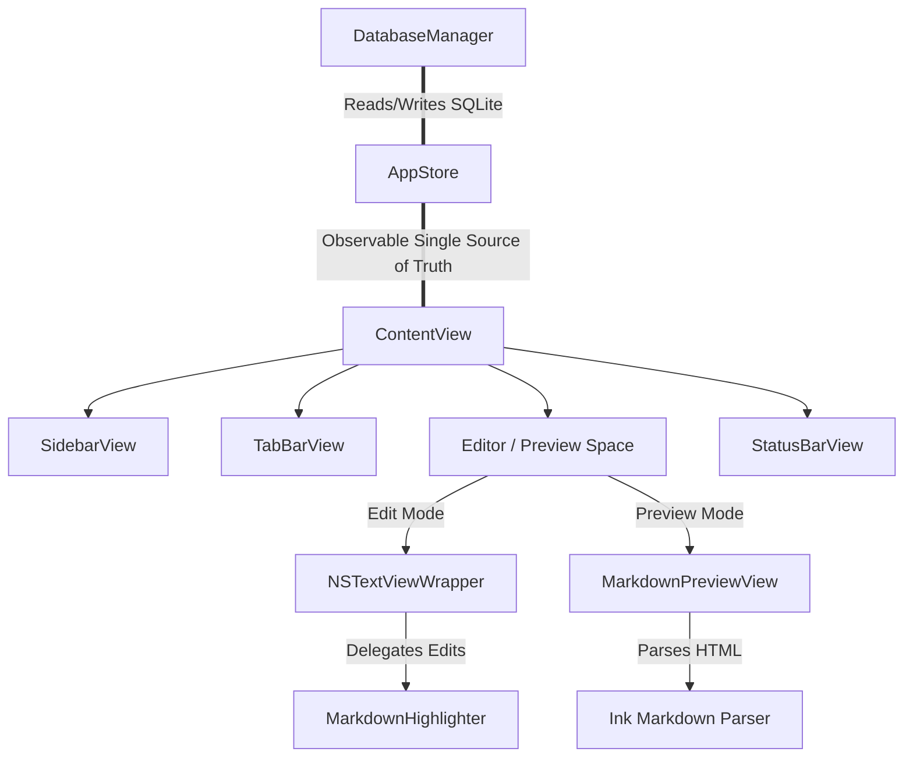

# Technical Design Specification

This document details the architecture, state flow, UI components, and layout decisions behind the current state of **TermiNotes v2.0.0**.

---

## 🏗️ Architectural Overview

TermiNotes is built as a native macOS AppKit-SwiftUI hybrid application utilizing an MVVM state architecture. The persistence layer uses SQLite to manage local notebooks.



---

## 💾 State Management & Data Flow

### The Unified App Store (`AppStore.swift`)
The store is marked with `@Observable` (SwiftUI 5+) to act as the single source of truth for the entire application, containing:
* `directories`: Current folder list.
* `notes`: Current notes list.
* `openTabs`: Ordered array of active opened notes.
* `activeTabId`: UUID reference of the active note.
* `activeNote`: Computed getter returning `openTabs.first(where: { $0.id == activeTabId })`.

### The Editor Bindings
To prevent SwiftUI from capturing stale value-type snapshots of the `Note` struct (which causes state updates to overwrite the editor and reset cursor locations), bindings evaluate properties dynamically from the reference-type store:
```swift
text: Binding(
    get: { store.activeNote?.content ?? "" },
    set: { store.updateNoteContent(noteId: note.id, content: $0) }
)
```

---

## 🖼️ UI Component Structure

1. **`ContentView`**: The layout shell dividing the screen. Uses a draggable divider gesture to update local `@AppStorage` sidebar widths.
2. **`SidebarView`**: Built around a bridged AppKit `NSOutlineView` to display hierarchical directory structures and support Drag-and-Drop operations on notes.
3. **`TabBarView`**: Renders a horizontal monospace tab menu. Each tab is a button with hover-sensitive close options and a bright green indicator (`#3dfd58`).
4. **`NSTextViewWrapper`**: An `NSViewRepresentable` bridging AppKit's `NSTextView`. Configured with monospace styles, caret colors, custom margin paddings, and line numbering.
5. **`MarkdownPreviewView`**: Wraps a `WKWebView` rendering HTML content produced by the John Sundell `Ink` package with a custom GitHub-style stylesheet.
6. **`StatusBarView`**: Monospace footer tracking character count, word count, and caret selection index mapped to row and column.

---

## 🛠️ Key Design & Engineering Decisions

### 1. Drawing Line Numbers Directly on Editor Background
Standard AppKit `NSRulerView` components conflict with SwiftUI's zero-frame rendering cycles during window loading, crashing the layout tree. TermiNotes bypasses this constraint by overriding `EditorTextView.drawBackground(in:)` to render line numbers and border separators manually on the background graphics canvas. Numbers are aligned to the first fragment of wrapped lines rather than centered.

### 2. Paragraph-Restricted Real-Time Syntax Highlighting
Applying regex rules to a full-document `NSTextStorage` causes layout managers to invalidate glyph trees for the entire document on every keystroke, resulting in cursor jumping and writing lag.
* **Typing Pass (`didProcessEditing`)**: The editor extends the changed range to line boundaries (`lineRange(for:)`) and applies styling only to the active paragraph range.
* **Code Block Intersection**: Fenced code blocks are scanned globally, but attributes are only written to the intersection with the active paragraph range.
* **Full Pass**: Full-document highlighting is run once when the active tab switches.
