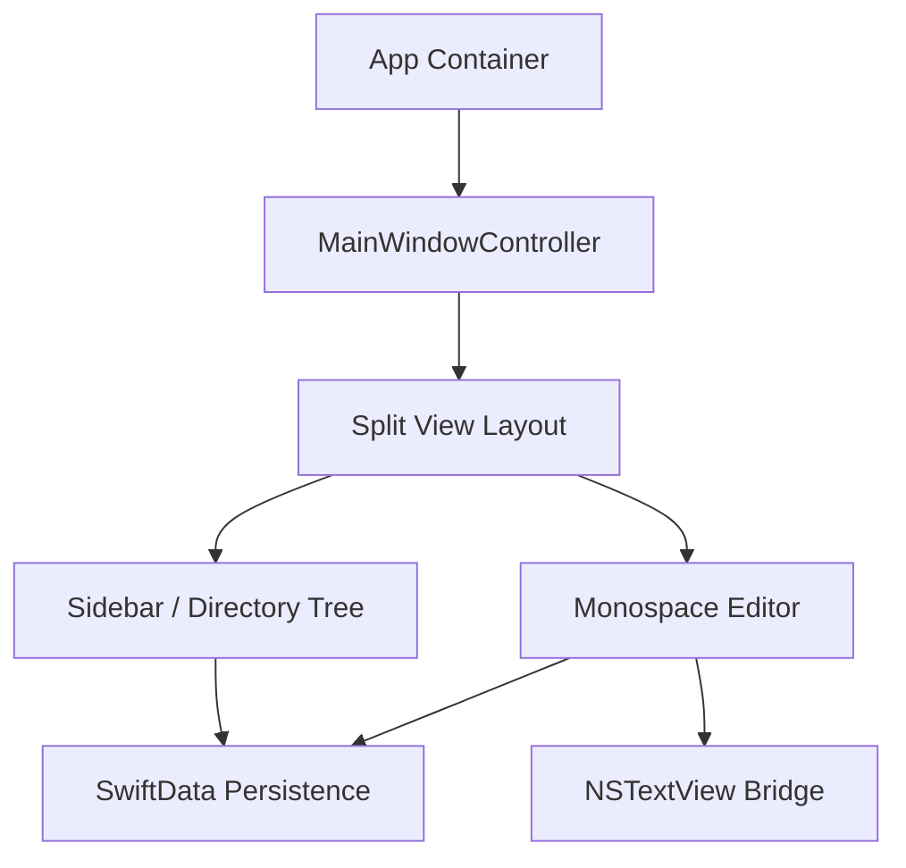

# TermiNotes Design Specification

* **Date:** 2026-06-26
* **Status:** Approved
* **Authors:** Antigravity (AI Architect)

---

## 1. Overview & Goals

TermiNotes is a native macOS note-taking application designed with a terminal-like developer aesthetic but relying on traditional graphical layout controls. This document details the technical design and architecture for the MVP build.

### Core Goals
* **Native Desktop Experience:** Build exclusively for macOS using Swift, SwiftUI, and SwiftData, targeting macOS 14+.
* **Monospace Canvas:** Provide a completely plain, distraction-free monospace editing pane mimicking terminal text editors.
* **Retro Tree Sidebar:** Render a single-level folder/note navigation hierarchy utilizing ASCII/monospace tree connectors (e.g. `├──` and `└──`).
* **Instant Performance:** Low startup latency, local-first SQLite-backed SwiftData storage, and rapid search response times.

---

## 2. Technical Architecture

The application is structured as a macOS SwiftUI app separating concerns into MVVM-style modules.



### Components
* **App Shell:** Standard SwiftUI `@main` struct with window definition configuring borderless style or custom title bars where applicable.
* **Layout Split:** SwiftUI `NavigationSplitView` or customized AppKit `NSSplitView` wrapper enabling sidebar dragging with width persisted via `UserDefaults`.
* **Sidebar Tree View:** SwiftUI `List` styled to hide default selection chrome, rendering custom monospace directory lists and note items prefix-connected using ASCII markers.
* **Monospace Editor:** A custom subclass of AppKit's `NSTextView` wrapped in a SwiftUI `NSViewRepresentable`. This grants granular control over text attributes, word-wrapping, margins, caret behavior, and text styling.
* **Persistence:** SQLite-backed `SwiftData` Container managing models reactively.

---

## 3. Data Models (SwiftData)

The database schema consists of two main entities with a one-to-many relationship:

```swift
import Foundation
import SwiftData

@Model
final class Directory {
    @Attribute(.unique) var id: UUID
    var name: String
    var sortOrder: Int
    var isCollapsed: Bool
    var createdAt: Date
    
    @Relationship(deleteRule: .cascade, inverse: \Note.directory) 
    var notes: [Note]?

    init(name: String, sortOrder: Int = 0) {
        self.id = UUID()
        self.name = name
        self.sortOrder = sortOrder
        self.isCollapsed = false
        self.createdAt = Date()
        self.notes = []
    }
}

@Model
final class Note {
    @Attribute(.unique) var id: UUID
    var title: String
    var content: String
    var createdAt: Date
    var updatedAt: Date
    
    var directory: Directory?

    init(title: String, content: String = "", directory: Directory? = nil) {
        self.id = UUID()
        self.title = title
        self.content = content
        self.createdAt = Date()
        self.updatedAt = Date()
        self.directory = directory
    }
}
```

---

## 4. UI & Interaction Design

### Left Pane: Retro Sidebar
The sidebar renders folders and notes in a single-level tree with monospace characters:

```text
📁 WORK/
├── todo.md
├── sprint.md
└── project-spec.md
📁 PERSONAL/
└── journal.md
```

* **Directories:** Section headers rendering folder name, directory status indicator (expanded/collapsed), and click handler toggling collapse state.
* **Notes:** Indented buttons with `├──` (middle child) or `└──` (last child) ASCII connectors. Clicking a note loads it into the editor.
* **Drag-and-Drop:** Ability to drag notes into different directory sections to re-associate parent IDs.

### Right Pane: Monospace Editor
* Wrapped inside `NSTextView` to disable rich text attributes, default macOS autocorrect bubbles, and fancy typography replacements (like smart quotes).
* Rendered with monospace fonts (e.g. SF Mono, JetBrains Mono) with configurable line height (1.4x) and generous side padding (16pt).
* Real-time autosave: Debounced listener trigger persists changes to SwiftData store on user typing pauses (500ms delay).

---

## 5. Keyboard Navigation & Shortcuts

Command operations are exposed via main menu commands and bound keyboard shortcuts:

* `Cmd + N`: Create new Note in the currently active/highlighted directory.
* `Cmd + Shift + N`: Display dialog prompt to create a new Directory.
* `Cmd + F`: Focus the search bar at the top of the sidebar.
* `Cmd + \`: Show/Hide the sidebar.
* `Cmd + Backspace`: Delete the selected note or directory (with confirmation alert).
* `Arrow Up / Down`: Move selection in the sidebar tree.

---

## 6. Verification & Test Plan

### Automated Tests
* **Unit Tests (SwiftData & Models):**
  * Validate creation, updating, and cascade deletion of directories and notes.
  * Verify parent-child relationship integrity when moving notes between directories.
* **UI & Integration Tests (XCTest UI):**
  * Check sidebar toggle shortcut works correctly.
  * Validate text view autosave triggers changes that persist to disk on app restart.
  * Ensure sidebar width remains identical after quitting and relaunching the app.

### Manual Verification Checklist
1. Open the application, create a directory, and verify it renders in the tree sidebar.
2. Create a note inside the directory; verify it shows up with correct prefix characters (`├──` or `└──`).
3. Type contents in the note, close the application, reopen, and confirm all entered text persists.
4. Drag a note from Directory A to Directory B in the sidebar, verifying parent directory remapping.
5. Hide the sidebar using `Cmd + \`, resizing the window to verify the editor centers and remains readable.
