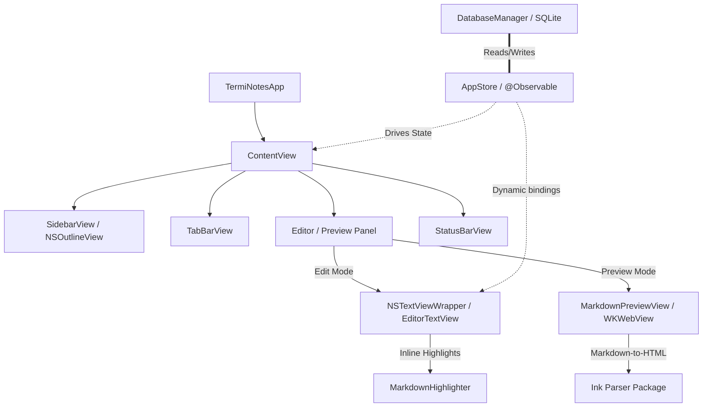
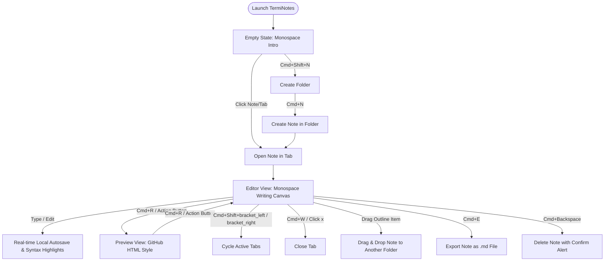

# TermiNotes

> Notes supposed to be simple.

TermiNotes is a native macOS note-taking application designed around a technical, terminal-like user experience. It combines a filesystem-inspired directory sidebar tree, a monospace distraction-free Markdown editor, and a live GitHub-style preview in a lightweight native desktop shell.

---

## 🏗️ App Architecture

The app is built using Swift, SwiftUI, and AppKit components managed by a single observable store and local SQLite database persistence.



---

## 🔄 User Flow & Navigation

The diagram below maps the runtime interactive flows and key shortcuts inside the workspace:



---

## ⚡ Features

* **Multi-Tab Workspace**: Open notes in tabs, navigate them using keyboard shortcuts, and hover-to-close.
* **Monospace Text Editor**: Terminal-style dark theme with customizable line number gutter rendering (wrap-aligned).
* **High-Performance Highlighting**: Scoped inline syntax highlighting that only repaints active edit paragraphs for typing fluidity.
* **GitHub-Style Preview**: Switch to a fully rendered GitHub dark-mode stylesheet preview.
* **Filesystem Tree & Drag-and-Drop**: Organize files into directory folders in the outline sidebar and drag notes to rearrange.
* **Monospaced Status Bar**: Shows current Ln, Col, word count, and character counts.
* **Data Security & Portability**: Data is persisted to a local SQLite database and can be exported as standard `.md` files.

---

## 🛠️ Getting Started

### Prerequisites
* **macOS 14.0+** (Sonoma or later)
* **Swift 5.9+ / Xcode 15.0+**

### Build and Run via Terminal
To build and run the application locally using the Swift Package Manager:

1. Clone the repository and navigate to the project directory:
   ```bash
   cd TermiNotes
   ```
2. Build the project:
   ```bash
   swift build
   ```
3. Run the application:
   ```bash
   swift run
   ```

---

## ⌨️ Keyboard Shortcuts

| Shortcut | Action |
| :--- | :--- |
| `Cmd + R` | Toggle Markdown Preview / Edit Mode |
| `Cmd + L` | Toggle Editor Line Numbers Gutter |
| `Cmd + W` | Close the Active Tab |
| `Cmd + Shift + [` | Switch to the Previous Tab |
| `Cmd + Shift + ]` | Switch to the Next Tab |
| `Cmd + N` | Create a New Note inside the Selected Folder |
| `Cmd + Shift + N` | Create a New Directory Folder |
| `Cmd + E` | Export active note as a sanitized Markdown `.md` file |
| `Cmd + \` | Toggle Sidebar visibility |
| `Cmd + Backspace`| Delete Selected Note (asks confirmation) |
